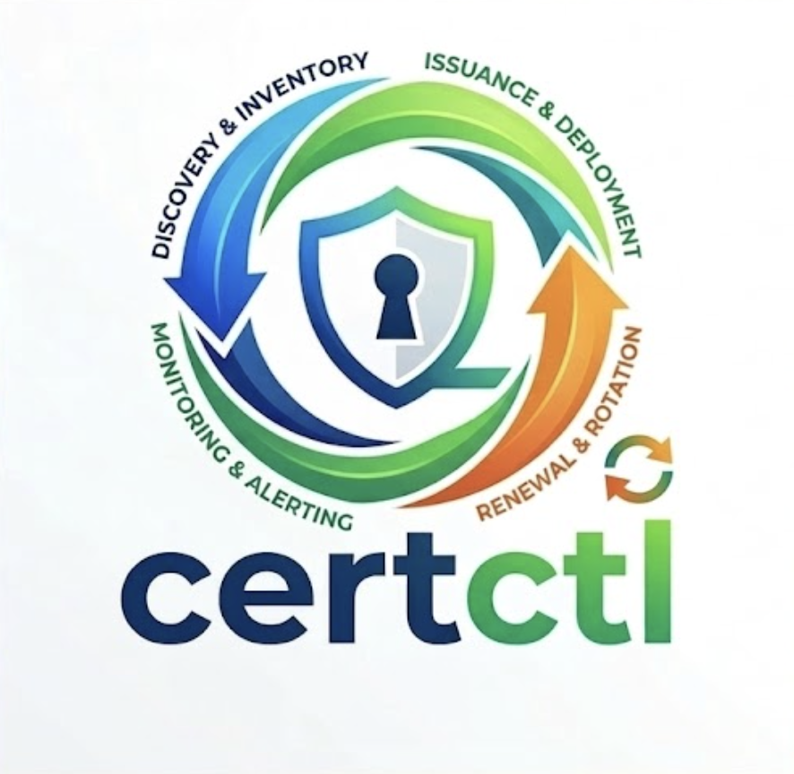
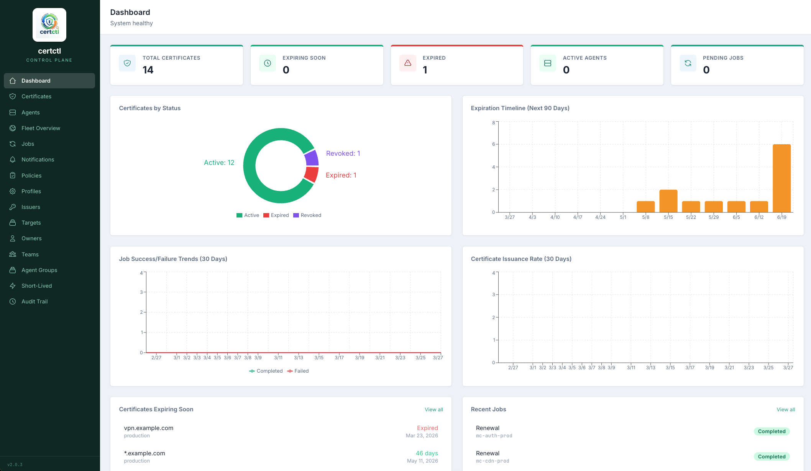
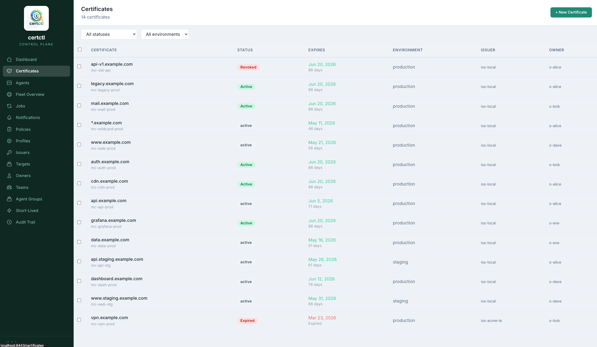
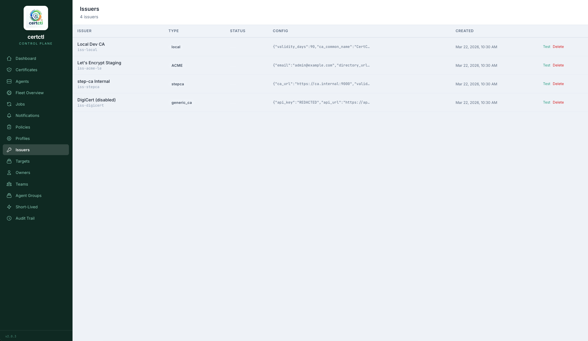
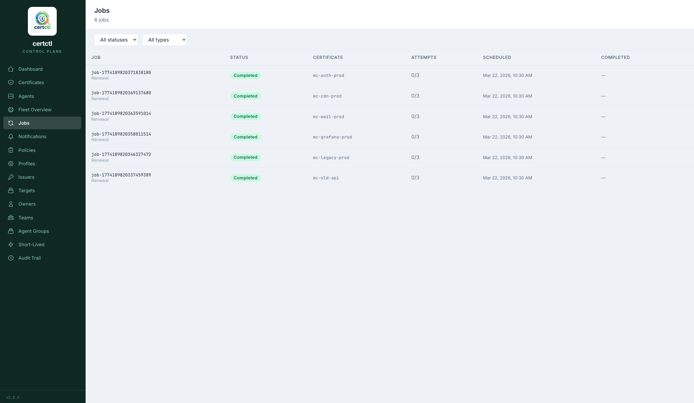

<p align="center">
  
</p>

# certctl — Self-Hosted Certificate Lifecycle Platform

[](LICENSE)
[](https://goreportcard.com/report/github.com/certctl-io/certctl)
[](https://github.com/certctl-io/certctl/releases)
[](https://github.com/certctl-io/certctl/stargazers)

certctl is a self-hosted platform that automates the entire TLS certificate lifecycle, from issuance through renewal to deployment, with zero human intervention. Twelve native CA connectors plus an OpenSSL / shell-script adapter for custom CAs; fifteen native deployment-target connectors plus a proxy-agent pattern for network appliances and agentless targets. Private keys stay on your infrastructure where they belong. Free, source-available under BSL 1.1, covers the same lifecycle that enterprise platforms charge $100K+/year for.

The CA/Browser Forum's [Ballot SC-081v3](https://cabforum.org/2025/04/11/ballot-sc081v3-introduce-schedule-of-reducing-validity-and-data-reuse-periods/) caps public TLS certificates at **200 days by March 2026**, **100 days by 2027**, and **47 days by 2029**. At 47-day lifespans, a team managing 100 certificates is processing 7+ renewals per week, every week, forever. Manual workflows stop being a choice.

> **Status: Early-access — actively looking for design partners.**

> The certificate lifecycle core is production-quality today: Local CA, ACME, agent deployment, audit, [role-based access control](docs/operator/rbac.md) with auditor split and four-eyes approval. v2.1.0 adds federated identity on top — [OIDC SSO](docs/operator/oidc-runbooks/index.md), server-side sessions, back-channel logout, and a break-glass admin path for SSO-outage recovery.

> If your team runs PKI infrastructure that could use real automation, we'd love to have you on certctl. Lab and dev deployments are great. Production is welcome too — especially on the federated-identity surface, where real-world IdP shapes are exactly the exposure we can't manufacture in CI. Battle-testing certctl in your environment is genuinely valuable to us.

> [File issues](https://github.com/certctl-io/certctl/issues) liberally. Every IdP quirk, every connector edge, every doc gap you hit — that's how the platform earns the right to drop the "early-access" label. The faster the loop, the faster everyone benefits.

> **Actively maintained, shipping weekly.** [Open an issue](https://github.com/certctl-io/certctl/issues) if something breaks. CI runs the full test suite with race detection, static analysis, and vulnerability scanning on every commit.

**Ready to try it?** Jump to the [Quick Start](#quick-start). For the marketing site, see [certctl.io](https://certctl.io).

## Documentation

The full audience-organized index lives at [`docs/README.md`](docs/README.md). Top-level entry points:

| Audience | Start here |
|---|---|
| New to certctl | [Concepts](docs/getting-started/concepts.md) → [Quickstart](docs/getting-started/quickstart.md) → [Examples](docs/getting-started/examples.md) |
| Production operator | [Architecture](docs/reference/architecture.md) → [Security posture](docs/operator/security.md) → [Disaster recovery runbook](docs/operator/runbooks/disaster-recovery.md) |
| PKI engineer | [ACME server](docs/reference/protocols/acme-server.md) → [SCEP server](docs/reference/protocols/scep-server.md) → [EST server](docs/reference/protocols/est.md) → [CA hierarchy](docs/reference/intermediate-ca-hierarchy.md) |
| Migrating from another tool | [from certbot](docs/migration/from-certbot.md) / [from acme.sh](docs/migration/from-acmesh.md) / [cert-manager coexistence](docs/migration/cert-manager-coexistence.md) |
| Contributor | [Architecture](docs/reference/architecture.md) → [Testing strategy](docs/contributor/testing-strategy.md) → [CI pipeline](docs/contributor/ci-pipeline.md) |

For the connector reference (12 issuers, 15 targets, 6 notifiers) see [`docs/reference/connectors/index.md`](docs/reference/connectors/index.md).

## Screenshots

<table>
<tr>
<td><a href="docs/screenshots/v2-dashboard.png"></a><br><b>Dashboard</b><br><sub>Stats, expiration heatmap, renewal trends, issuance rate</sub></td>
<td><a href="docs/screenshots/v2-certificates.png"></a><br><b>Certificates</b><br><sub>Inventory with bulk ops, status filters, owner/team columns</sub></td>
</tr>
<tr>
<td><a href="docs/screenshots/v2-issuers.png"></a><br><b>Issuers</b><br><sub>Catalog with 12 CA types, GUI config, test connection</sub></td>
<td><a href="docs/screenshots/v2-jobs.png"></a><br><b>Jobs</b><br><sub>Issuance, renewal, deployment queue with approval workflow</sub></td>
</tr>
</table>

**[See all screenshots →](docs/screenshots/)**

## Why certctl

Certificate lifecycle tooling has historically split into two camps. Enterprise platforms charge six-figure annual licenses, take months to deploy, and bill professional-services hours at $250 to $400 per hour to write integration code that should ship with the product. Single-purpose tools handle one slice of the problem and leave the operator to glue the rest together. certctl fills the gap — full lifecycle automation, self-hosted, free, CA-agnostic, target-agnostic. If you're stitching together cron jobs across a fleet, manually renewing certs, or writing custom integration scripts to bridge a commercial CLM platform to your actual infrastructure, certctl replaces all of that.

Built for **platform engineering and DevOps teams** managing 10 to 500+ certificates, **security teams** who need audit trails and policy enforcement, and **small teams without enterprise budgets** who need enterprise-grade automation for a 50-server environment. For the detailed positioning argument and when not to use certctl, see [Why certctl?](docs/getting-started/why-certctl.md).

## What it does

certctl handles the full certificate lifecycle in one self-hosted control plane:

- **Issue and renew** from any CA. Let's Encrypt and any ACME provider, an embedded ACME server you can point cert-manager / certbot / lego at directly, a built-in local CA with sub-CA mode (chains under your enterprise root like ADCS), step-ca, Vault PKI, EJBCA, AWS ACM PCA, Google CAS, DigiCert, Sectigo, GlobalSign, Entrust, plus an OpenSSL / shell-script adapter for anything custom. Twelve native issuer connectors. See the [connector reference](docs/reference/connectors/index.md).
- **Deploy automatically** to NGINX, Apache, HAProxy, Caddy, Traefik, Envoy, IIS, Windows Cert Store, Java keystore, Kubernetes Secrets, AWS ACM, Azure Key Vault, SSH known-hosts, Postfix + Dovecot, F5 BIG-IP. Fifteen native target connectors. File-based targets share an atomic-write + SHA-256 idempotency + on-failure rollback + per-target Prometheus counters primitive (the `deploy.Apply` path covers 12 of 13 file-based connectors). Cloud / API targets (AWS ACM, Azure Key Vault) use vendor-SDK semantics rather than the file primitive; F5 uses iControl REST transactions; Kubernetes Secrets is preview. For the per-target guarantee matrix, see [`docs/reference/deployment-model.md`](docs/reference/deployment-model.md). The reload / validate commands operators configure for shell-using targets (NGINX, Apache, HAProxy, Postfix, JavaKeystore, SSH) are validated server-side AND agent-side against shell-metacharacter injection before execution (see [`internal/connector/target/configcheck`](internal/connector/target/configcheck)).
- **Run as an ACME server** so existing client tooling plugs in directly. RFC 8555 + RFC 9773 ARI, two per-profile auth modes (public-trust-style validation or trust_authenticated for internal PKI), doubly-signed key rollover, revoke-cert on both kid path and jwk path, per-account rate limiting. Cert-manager / certbot / lego all work pointed at it. See [`docs/reference/protocols/acme-server.md`](docs/reference/protocols/acme-server.md).
- **Run as a SCEP server** for Microsoft Intune-managed phones, ChromeOS devices, network appliances. RFC 8894 native with full PKIMessage wire format, native Intune challenge dispatch with replay protection, per-profile dispatch with separate RA cert per profile. See [`docs/reference/protocols/scep-server.md`](docs/reference/protocols/scep-server.md).
- **Run as an EST server** for HTTPS-based PKCS#10 enrollment. 802.1X / Wi-Fi authentication, IoT device enrollment, RFC 9266 channel binding. See [`docs/reference/protocols/est.md`](docs/reference/protocols/est.md).
- **Manage multi-level CA hierarchies** with name constraints, path-length enforcement, and end-to-end RFC 5280 path validation. Root → intermediate → issuing chains, admin-gated CRUD, drain-first retirement. Patterns documented for 4-level boundary CAs, 3-level policy CAs with per-BU `PermittedDNSDomains`, and 2-level internal PKI. See [`docs/reference/intermediate-ca-hierarchy.md`](docs/reference/intermediate-ca-hierarchy.md).
- **Gate high-stakes issuance** behind two-person-integrity approval. Flag a profile as `RequiresApproval`, the request lands in a queue, a non-requester approves, the scheduler dispatches. Profile-edit changes on approval-tier profiles route through the same gate so the flip-flop bypass is closed. See [`docs/operator/approval-workflow.md`](docs/operator/approval-workflow.md).
- **Authorize with role-based access control.** Seven default roles (admin, operator, viewer, agent, mcp, cli, auditor) over a fine-grained permission catalogue with global / per-profile / per-issuer scope. Auditor role is read-only on the audit trail (`audit.read` + `audit.export`, nothing else) so a regulator's key cannot read certificates or mutate config. Day-0 admin via a one-shot `CERTCTL_BOOTSTRAP_TOKEN` endpoint that closes itself the moment any admin lands. Privilege-escalation guard requires `auth.role.assign` to grant or revoke a role. See [`docs/operator/rbac.md`](docs/operator/rbac.md), [`docs/operator/auth-threat-model.md`](docs/operator/auth-threat-model.md), and the v2.0.x → v2.1.0 [migration guide](docs/migration/api-keys-to-rbac.md).
- **Sign in with OIDC SSO** against any standards-compliant identity provider. Per-IdP setup runbooks for Keycloak, Authentik, Okta, Auth0, Microsoft Entra ID, and Google Workspace. Group-claim → role mapping for automatic provisioning; client_secret encrypted at rest (AES-256-GCM); JWKS auto-refresh on `kid` miss; PKCE-S256 required; RFC 9700 §4.7.1 pre-login UA/IP binding; RFC 9207 `iss` URL-param check on callback. Server mints HMAC-signed session cookies with the `__Host-` prefix (browser-enforced subdomain-takeover defense), CSRF rotation on every privileged write, and idle + absolute expiry. [RFC OIDC Back-Channel Logout 1.0](docs/reference/auth-standards-implemented.md) revokes sessions on IdP-driven logout. Argon2id break-glass admin path for SSO-outage recovery — disabled by default; 404-invisible to scanners when `CERTCTL_BREAKGLASS_ENABLED=false`. See [`docs/operator/oidc-runbooks/index.md`](docs/operator/oidc-runbooks/index.md) for the per-IdP onboarding guides and [`docs/migration/oidc-enable.md`](docs/migration/oidc-enable.md) for enabling SSO on an existing deploy.
- **Discover** existing certs across your fleet via filesystem scanning on agents, network TLS probing across CIDR ranges, and cloud secret manager imports (AWS Secrets Manager, Azure Key Vault, GCP Secret Manager). Triage workflow for claim / dismiss / investigate.
- **Revoke** with full RFC 5280 reason codes, DER CRL generation per issuer (scheduler-pre-generated and ETag-cached), and an embedded RFC 6960 OCSP responder with dedicated per-issuer responder certs. Single + bulk revocation. See [`docs/reference/protocols/crl-ocsp.md`](docs/reference/protocols/crl-ocsp.md).
- **Alert** via Slack, Microsoft Teams, PagerDuty, OpsGenie, email, webhooks. Per-policy multi-channel routing matrix with severity tiers and fault-isolating per-channel dispatch. See [`docs/operator/runbooks/expiry-alerts.md`](docs/operator/runbooks/expiry-alerts.md).
- **Drive the platform from natural language** via the bundled MCP (Model Context Protocol) server. The full REST API is exposed as MCP tools — ask your AI client "show me all expiring certificates", "revoke the VPN cert, key compromised", or "what agents are offline?" and it translates to API calls. Stateless stdio-transport binary at `cmd/mcp-server/`; same auth as the REST API; no extra attack surface. See [`docs/reference/mcp.md`](docs/reference/mcp.md).

## Architecture and security

Go 1.25 control plane with handler → service → repository layering. PostgreSQL 16 backend with idempotent migrations. Pull-only deployment model — the server never initiates outbound connections. Agents poll for work and generate ECDSA P-256 keys locally so private keys never touch the control plane. For network appliances and agentless servers, a proxy agent in the same network zone handles deployment via the target's API (WinRM, iControl REST, SSH/SFTP). See the [Architecture Guide](docs/reference/architecture.md) for full system diagrams.

Security: three authentication paths — API keys (SHA-256 hashed + constant-time compared), [OIDC SSO](docs/operator/oidc-runbooks/index.md) (Keycloak / Authentik / Okta / Auth0 / Entra ID / Google Workspace), and Argon2id [break-glass admin](docs/operator/security.md) for SSO-outage recovery. Successful OIDC login mints an HMAC-signed server-side session with `__Host-` cookies, CSRF rotation on every privileged write, and [RFC OIDC Back-Channel Logout](docs/reference/auth-standards-implemented.md) for IdP-driven session revoke. Role-based authorization on every gated handler with global / per-profile / per-issuer scope. Auditor split keeps regulator-class actors strictly read-only on the audit trail. Day-0 admin via a one-shot bootstrap token; granting or revoking roles requires the dedicated `auth.role.assign` permission. CORS deny-by-default. Shell injection prevention on all connector scripts. SSRF protection (reserved IP filtering) on the network scanner. Issuer + target + OIDC client_secret credentials encrypted at rest with AES-256-GCM. HTTPS-only control plane with TLS 1.3 pinned and a fail-closed startup gate that refuses to boot if the TLS bundle is unusable. Every API call recorded to an immutable audit trail with actor attribution, body hash, and latency tracking. CI runs race detection, static analysis, and vulnerability scanning on every commit. See [`docs/operator/security.md`](docs/operator/security.md) for the full posture and [`docs/operator/auth-threat-model.md`](docs/operator/auth-threat-model.md) for what's defended vs deferred.

## Quick Start

### Docker Compose (recommended)

**Demo path — zero config, populated dashboard:**

```bash
git clone https://github.com/certctl-io/certctl.git
cd certctl
docker compose -f deploy/docker-compose.yml -f deploy/docker-compose.demo.yml up -d --build
```

Wait ~30 seconds, then open **https://localhost:8443** in your browser. The demo overlay flips the base into demo-mode auth (every request served as the synthetic admin actor `actor-demo-anon` — the server emits a prominent ⚠ DEMO MODE banner at boot reminding you this posture is for evaluation only) and seeds 180 days of realistic history across 13 issuers, 8 agents, managed + discovered certs, jobs, deploys, audit, and notification events. The `certctl-tls-init` init container self-signs an ECDSA-P256 cert on first boot — accept the browser warning for the demo, or feed the generated `ca.crt` to your client.

**Production path — `.env` required, fail-closed on placeholders:**

```bash
cp .env.example deploy/.env       # or root .env if running outside compose
$EDITOR deploy/.env                # set POSTGRES_PASSWORD, CERTCTL_AUTH_SECRET,
                                   # CERTCTL_API_KEY, CERTCTL_CONFIG_ENCRYPTION_KEY,
                                   # CERTCTL_AGENT_ID — all via openssl rand
docker compose -f deploy/docker-compose.yml up -d --build
```

The base compose alone (no demo overlay) ships production-shaped: default `auth-type=api-key`, default `keygen-mode=agent`, no demo seed, no demo-mode synthetic admin. The fail-closed startup guards in `internal/config/config.go::Validate` refuse to boot when any of the change-me-... placeholder credentials reach config outside of demo mode (Bundle 2 closure, 2026-05-12). The four compose files (`docker-compose.yml` base, `docker-compose.demo.yml` overlay, `docker-compose.dev.yml` for PgAdmin + debug logging, `docker-compose.test.yml` for integration tests) are documented at [`deploy/ENVIRONMENTS.md`](deploy/ENVIRONMENTS.md).

```bash
curl --cacert $(docker compose -f deploy/docker-compose.yml exec -T certctl-server cat /etc/certctl/tls/ca.crt) https://localhost:8443/health
# {"status":"healthy"}
```

The control plane is HTTPS-only with TLS 1.3 pinned. See [`docs/operator/tls.md`](docs/operator/tls.md) for cert provisioning patterns.

### Agent install (one-liner)

```bash
curl -sSL https://raw.githubusercontent.com/certctl-io/certctl/master/install-agent.sh | bash
```

Detects your OS and architecture, downloads the binary, configures systemd (Linux) or launchd (macOS), and starts the agent. See [install-agent.sh](install-agent.sh).

### Helm chart (Kubernetes)

```bash
helm install certctl deploy/helm/certctl/ \
  --set server.auth.apiKey=your-api-key \
  --set postgresql.password=your-db-password
```

Production-ready chart with Server Deployment, PostgreSQL StatefulSet, Agent DaemonSet, health probes, security contexts (non-root, read-only rootfs), and optional Ingress. See [values.yaml](deploy/helm/certctl/values.yaml).

### Container images

```bash
docker pull ghcr.io/certctl-io/certctl-server:latest
docker pull ghcr.io/certctl-io/certctl-agent:latest
```

## Examples

Pick the scenario closest to your setup and have it running in 2 minutes:

| Example | Scenario |
|---------|----------|
| [`examples/acme-nginx/`](examples/acme-nginx/) | Let's Encrypt + NGINX, HTTP-01 challenges |
| [`examples/acme-wildcard-dns01/`](examples/acme-wildcard-dns01/) | Wildcard certs via DNS-01 (Cloudflare hook included) |
| [`examples/private-ca-traefik/`](examples/private-ca-traefik/) | Local CA (self-signed or sub-CA) + Traefik file provider |
| [`examples/step-ca-haproxy/`](examples/step-ca-haproxy/) | Smallstep step-ca + HAProxy combined PEM |
| [`examples/multi-issuer/`](examples/multi-issuer/) | ACME for public + Local CA for internal, one dashboard |

Each directory contains a `docker-compose.yml` and a `README.md` explaining the scenario, prerequisites, and customization.

## Verifying a release

Every `v*` tag publishes signed, attested artefacts (Cosign keyless OIDC + SLSA Level 3 provenance + SPDX-JSON SBOMs). For the verification procedure, see [`docs/reference/release-verification.md`](docs/reference/release-verification.md).

## Development

```bash
make build              # Build server + agent binaries
make test               # Run tests
make lint               # golangci-lint (govet + staticcheck + contextcheck + unused)
govulncheck ./...       # Vulnerability scan
make docker-up          # Start Docker Compose stack
```

CI runs `go vet`, `go test -race`, `golangci-lint`, `govulncheck`, and per-package coverage thresholds (service 70%, handler 75%, crypto 88%, auth packages 85-95%) on every push. The thresholds-as-data file is `.github/coverage-thresholds.yml`; lowering a floor requires corresponding test work, not a config flip. Frontend CI runs TypeScript type checking, Vitest tests, and Vite production build.

For the full contributor guide see [`docs/contributor/`](docs/contributor/) — testing strategy, test environment, CI pipeline, QA prerequisites.

## License

Licensed under the [Business Source License 1.1](LICENSE). The source code is publicly available and free to use, modify, and self-host. The one restriction: you may not use certctl's certificate management functionality as part of a commercial certificate-management offering to third parties. See the LICENSE file for the full Additional Use Grant.

For licensing inquiries: certctl@proton.me

## Dependencies

```bash
go list -m all | wc -l   # total module count (direct + transitive)
go mod why <path>        # explain why a module is pulled in
govulncheck ./...        # vulnerability scan (CI runs this on every commit)
```

The release-time SBOM is published as an SPDX-JSON file alongside each release artifact.

---

If certctl solves a problem you have, [star the repo](https://github.com/certctl-io/certctl) to help others find it. Questions, bugs, or feature requests: [open an issue](https://github.com/certctl-io/certctl/issues).
